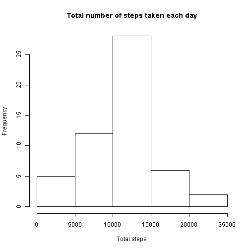
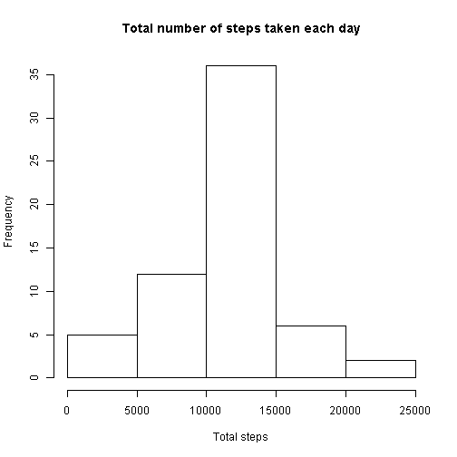

# Libraries
Loading the libraries.

```r
library(dplyr)
```

# Loading the data

```r
raw <- read.csv("activity.csv")
str(raw)
```

```
## 'data.frame':	17568 obs. of  3 variables:
##  $ steps   : int  NA NA NA NA NA NA NA NA NA NA ...
##  $ date    : Factor w/ 61 levels "2012-10-01","2012-10-02",..: 1 1 1 1 1 1 1 1 1 1 ...
##  $ interval: int  0 5 10 15 20 25 30 35 40 45 ...
```

# Ignoring the missing values

```r
ignored.NAs <- raw[!is.na(raw$steps),]
str(ignored.NAs)
```

```
## 'data.frame':	15264 obs. of  3 variables:
##  $ steps   : int  0 0 0 0 0 0 0 0 0 0 ...
##  $ date    : Factor w/ 61 levels "2012-10-01","2012-10-02",..: 2 2 2 2 2 2 2 2 2 2 ...
##  $ interval: int  0 5 10 15 20 25 30 35 40 45 ...
```

# Total steps per day (ignoring the missing values)
Compute the total steps per day.

```r
total.steps.per.day <- ignored.NAs %>%
                       group_by(date) %>%
                       summarize(steps = sum(steps))
str(total.steps.per.day)
```

```
## Classes 'tbl_df', 'tbl' and 'data.frame':	53 obs. of  2 variables:
##  $ date : Factor w/ 61 levels "2012-10-01","2012-10-02",..: 2 3 4 5 6 7 9 10 11 12 ...
##  $ steps: int  126 11352 12116 13294 15420 11015 12811 9900 10304 17382 ...
```

Plot the total steps per day.

```r
hist(total.steps.per.day$steps, main="Steps per day", xlab="Total steps")
```

 

Mean and median values of total steps per day.

```r
mean1 <- mean(total.steps.per.day$steps)
print(mean1)
```

```
## [1] 10766.19
```

```r
median1 <- median(total.steps.per.day$steps)
print(median1)
```

```
## [1] 10765
```

# Mean steps per time interval (ignoring the missing values)

Compute the means per interval.

```r
mean.steps.per.interval <- ignored.NAs %>%
                           group_by(interval) %>%
                           summarize(mean.steps = mean(steps))
str(mean.steps.per.interval)
```

```
## Classes 'tbl_df', 'tbl' and 'data.frame':	288 obs. of  2 variables:
##  $ interval  : int  0 5 10 15 20 25 30 35 40 45 ...
##  $ mean.steps: num  1.717 0.3396 0.1321 0.1509 0.0755 ...
```

Plot the means per internal.

```r
with(mean.steps.per.interval, plot(interval, mean.steps, type='l'))
```

 

Interval with the max mean steps.

```r
max.steps.value <- max(mean.steps.per.interval$mean.steps)
max.steps.interval <- mean.steps.per.interval$interval[mean.steps.per.interval$mean.steps==max.steps.value]
print(max.steps.interval)
```

```
## [1] 835
```
The max interval is `max.steps.interval`.

# Imputing missing values

Get the count of missing steps values in raw data.

```r
missing.values <- sum(is.na(raw$steps))
print(missing.values)
```

```
## [1] 2304
```

Impute the means per interval (computed before) as the default values for missing values.

```r
imputed <- raw %>%
           left_join(mean.steps.per.interval) %>%
           mutate(steps = ifelse(is.na(steps), mean.steps, steps))
```

```
## Joining by: "interval"
```

```r
imputed$mean.steps <- NULL # Added by the left join, no more needed
```

# Total steps per day (with imputed missing values)
Compute the total steps per day.

```r
total.steps.per.day <- imputed %>%
                       group_by(date) %>%
                       summarize(steps = sum(steps))
str(total.steps.per.day)
```

```
## Classes 'tbl_df', 'tbl' and 'data.frame':	61 obs. of  2 variables:
##  $ date : Factor w/ 61 levels "2012-10-01","2012-10-02",..: 1 2 3 4 5 6 7 8 9 10 ...
##  $ steps: num  10766 126 11352 12116 13294 ...
```

Plot the total steps per day.

```r
hist(total.steps.per.day$steps, main="Steps per day", xlab="Total steps")
```

 

Mean and median values of total steps per day.

```r
mean2 <- mean(total.steps.per.day$steps)
print(mean2)
```

```
## [1] 10766.19
```

```r
median2 <- median(total.steps.per.day$steps)
print(median2)
```

```
## [1] 10766.19
```

Compare with the mean and median without imputing missing values:

```r
print(mean1)
```

```
## [1] 10766.19
```

```r
print(median1)
```

```
## [1] 10765
```
The mean remains the same (as we use the means for imputing, it looks consistent).

The median did change.

# Means per interval, weekend vs. weekday (with imputed missing values)

Add the daytype factor

```r
# As I am not using the English locale, I prefer to use weekday numbers, rather than (localized) weekday names
day.of.week <- as.POSIXlt(imputed$date)$wday

weekend <- (day.of.week == 0) | (day.of.week == 6) # 0 = Sunday, 6 = Saturday

imputed.with.daytype <- imputed %>%
                        mutate(daytype = factor(weekend, labels=c("weekday", "weekend")))
```

Plot in 2 panels.


```r
# Prepare 2 panels
par(mfrow=c(2,1))

# Panel 1: weekend
mean.steps.per.interval <- imputed.with.daytype %>%
                           filter(daytype=="weekend") %>%
                           group_by(interval) %>%
                           summarize(mean.steps = mean(steps))

with(mean.steps.per.interval, plot(interval, mean.steps, type='l', main="weekend"))

# Panel 2: weekday
mean.steps.per.interval <- imputed.with.daytype %>%
                           filter(daytype=="weekday") %>%
                           group_by(interval) %>%
                           summarize(mean.steps = mean(steps))

with(mean.steps.per.interval, plot(interval, mean.steps, type='l', main="weekday"))
```

 


We do notice very different patterns. Much less steps in working days, at working hours.
